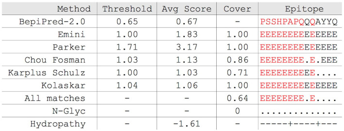
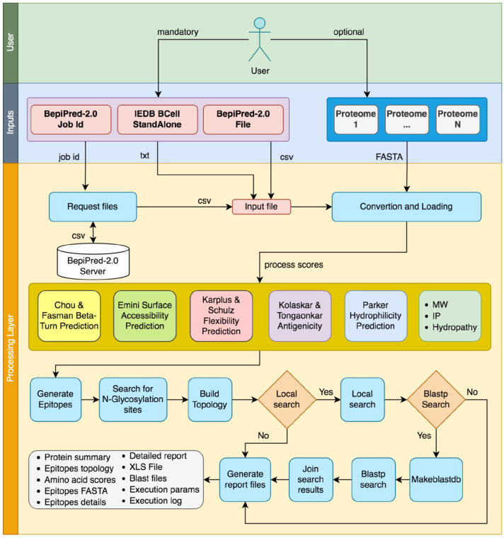

# EpiBuilder-2
### _A Tool for Assembling, Searching, and Classifying B-Cell Epitopes_

### Features that you will have using EpiBuilder-2:
- Use your BepiPred3 predictions or FASTA files (new)
- Epitopes list (including FASTA)
- Build your epitopes by length (min, max) and score
- Search your epitopes in proteomes 
- Received several output files including XLSX (please explore the results)
- Biochemical features such as: 

| Method | Description |  Reference |
| ------ | ------ |  ------ |
| Chou and Fasman | Beta turn prediction  | [Link](https://pubmed.ncbi.nlm.nih.gov/364941/) |
| Emini | Surface accessibility scale | [Link](https://pubmed.ncbi.nlm.nih.gov/2991600/) |
| Karplus and Schulz | Chain flexibility scale | [Link](https://link.springer.com/article/10.1007/BF01195768) |
| Kolaskar and Tongaonkar | Antigenicity scale | [Link](https://pubmed.ncbi.nlm.nih.gov/1702393/) |
| Parker | Hydrophilicity prediction | [Link](https://pubmed.ncbi.nlm.nih.gov/2430611/) |
- Summary of your run
- Epitope topology (see your epitopes with their biochemical feature)

## The EpiBuilder-2 processes (under construction)

## Input options
This version is adapted exclusively for Biolib, so the only CSV accepted here is the generated one by [BepiPred-3](https://biolib.com/DTU/BepiPred-3/)

| Type | Description |
| ------ | ------ |
| CSV | file generated by BepiPred-3 (raw_output.csv)|
| FASTA | FASTA file|

* BepiPred-3 presents a new score method (the default threshold is 0.1512, previously BepiPred 2.0 was ~0.5)

## Output options
| Type | Description | File |
| ------ | ------ | ------ |
| xlsx | Excel file with epitopes detail, search, topology and summary | run-epibuilder.xlsx |
| txt | Plain text with all informations and generated reports | run-epibuilder.txt |
| .log | Output software log | run-epibuilder.log |
| tsv | Detailed topology | run-epibuilder-topology.tsv |
| tsv | All calculated scores | run-epibuilder-scores.tsv |
| tsv | Protein summary with number of epitopes by protein | run-epibuilder-protein-summary.tsv |
| txt | The parameters of your run | run-epibuilder-parameters.txt |
| fasta | The epitopes in a FASTA file | run-epibuilder-epitopes-fasta.fasta |
| tsv | The epitopes details | run-epibuilder-epitope-detail.fasta |
| csv | Blast generated files by proteome | run-epibuilder-blast-PROTEOME_blast.csv |
| psq, pdb, phr, pin, pjs, pot, psq, ptf, pto | Other blast generated files | * |
[Download here a zip file with all files](https://github.com/simoesrenato/bioinfo/blob/master/epibuilder/test/EpiBuilder-1-results-example.zip?raw=true)

Check the [source code](https://github.com/simoesrenato/bioinfo/tree/master/epibuilder) 
Developed by Dr. Renato Simoes - renato.simoes@ifsc.edu.br

## License

MIT

Please cite us
_[Moreira RS, Filho VB, Calomeno NA, Wagner G, Miletti LC. EpiBuilder: A Tool for Assembling, Searching, and Classifying B-Cell Epitopes. Bioinform Biol Insights. 2022 May 11;16:11779322221095221. doi: 10.1177/11779322221095221. PMID: 35571557; PMCID: PMC9102138.](https://pubmed.ncbi.nlm.nih.gov/35571557/)_

